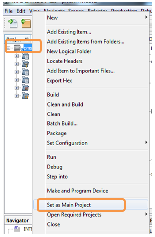
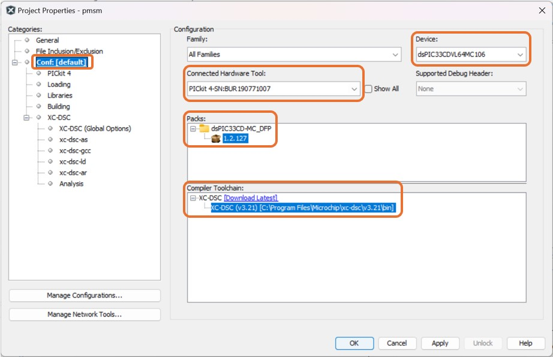

 
## Sensorless FOC using PLL Estimator and Single-Shunt Current Reconstruction Algorithm for PMSM with Fan Load: Automotive Cooling Fan Reference Design

## 1. INTRODUCTION
This document describes the setup requirements for driving a Permanent Magnet Synchronous Motor (PMSM) using Sensorless Field Oriented Control (FOC) and PLL Estimator Algorithm for a Fan Load on the hardware platform [Automotive Cooling Fan Reference Design](https://www.microchip.com/en-us/tools-resources/reference-designs/automotive-cooling-fan-reference-design).

For details about PLL estimator, refer to Microchip application note [AN1292](https://ww1.microchip.com/downloads/aemDocuments/documents/OTH/ApplicationNotes/ApplicationNotes/01292A.pdf) “Sensorless Field Oriented Control (FOC) for a Permanent Magnet Synchronous Motor (PMSM) Using a PLL Estimator and Field Weakening (FW)”

For details about Single-Shunt Current Reconstruction algorithm, refer to Microchip application note [AN1299](https://ww1.microchip.com/downloads/aemDocuments/documents/MCU16/ApplicationNotes/ApplicationNotes/01299A.pdf) "Single-Shunt Three-Phase Current Reconstruction Algorithm for Sensorless FOC of a PMSM".
 

## 2. SUGGESTED DEMONSTRATION REQUIREMENTS

### 2.1 Motor Control Application Firmware Required for the Demonstration

To clone or download this application firmware on GitHub, 
- Navigate to the [main page of this repository](https://github.com/microchip-pic-avr-solutions/ref-design-acf-33cdvl64mc106-pmsm-fan-an1299-foc) and 
- On the tab **<> Code**, above the list of files in the right-hand corner, click Code, then from the menu, click **Download ZIP** or copy the repository URL to **clone.**
> **Note:**  
>In this document, hereinafter this firmware package is referred as **firmware.**
### 2.2 Software Tools Used for Testing the firmware

- MPLAB® X IDE **v6.20** 
- Device Family Pack (DFP): **dsPIC33CD-MC_DFP v1.2.127**
- PICkit™  Tool Pack : **PICkit4_TP v2.6.2088**
- MPLAB® XC-DSC Compiler **v3.10**
- MPLAB® X IDE Plugin: **X2C-Scope v1.7.0**
- LIN Serial Analyzer Application: **v3.0.0** 
> **Note:**  
>The software used for testing the firmware prior to release is listed above. It is recommended to use these or later versions of the tool for building the firmware. All previous versions of Device Family Packs (DFP) and Tool Packs can be downloaded from [Microchip Packs Repository.](https://packs.download.microchip.com/)
### 2.3 Hardware Tools Required for the Demonstration
- [Automotive Cooling Fan Reference Design](https://www.microchip.com/en-us/tools-resources/reference-designs/automotive-cooling-fan-reference-design)
- MPLAB® PICkit™ 4 In-Circuit Debugger [(PG164140)](https://www.microchip.com/en-us/development-tool/pg164140) or MPLAB® PICkit™ 5 In-Circuit Debugger [(PG164150)](https://www.microchip.com/en-us/development-tool/pg164150)
- MCP2200 Isolated USB to UART Board [(ADM00276)](https://www.microchip.com/en-us/development-tool/adm00276)
- Microchip LIN Serial Analyzer [(APGDT001)](https://www.microchip.com/en-us/development-tool/apgdt001) 
- 12V Power Supply 

> **Note:**  
> The programmer/debugger and communication interface boards for the demonstration are available at [microchip DIRECT](https://www.microchipdirect.com/) 
 

## 3. HARDWARE SETUP
This section describes the hardware setup required for the demonstration.
> **Note:**  
>In this document, hereinafter the Automotive Cooling Fan Reference Design is referred as **board**.

1. Interface the **MPLAB® PICkit™ 4 In-Circuit Debugger** onto the board through **connector J1**. Make sure the programmer/debugger is orineted correctly.

     

     

2. Connect the **MCP2200 Isolated USB-UART Board** to the **connector J2** and the **LIN Serial Analyzer** to the **connector J4**.

     

      

3. Connect the +12V DC power supply on the terminal **B+** and **B-** on the board. The polarity must be ensured while connecting.

     

     

 

 4. Motor phases can be interafaced to the terminals **PHASE A**, **PHASE B** and **PHASE C**. The phase sequence needs to be verified with the direction of rotation of fan load.
      

     

  
 
## 4. SOFTWARE SETUP AND RUN
### 4.1 Setup: MPLAB X IDE and MPLAB XC-DSC Compiler
Install **MPLAB X IDE** and **MPLAB XC-DSC Compiler** versions that support the device **dsPIC33CDVL64MC106** and **PICkit4**. The MPLAB X IDE, MPLAB XC-DSC Compiler, and X2C-Scope plug-in used for testing the firmware are mentioned in the [Motor Control Application Firmware Required for the Demonstration](#21-motor-control-application-firmware-required-for-the-demonstration) section. 

To get help on  

- MPLAB X IDE installation, refer [link](https://microchipdeveloper.com/mplabx:installation)
- MPLAB XC-DSC Compiler installation steps, refer [link](https://developerhelp.microchip.com/xwiki/bin/view/software-tools/xc-dsc/install/)

If MPLAB IDE v8 or earlier is already installed on your computer, then run the MPLAB driver switcher (Installed when MPLAB®X IDE is installed) to switch from MPLAB IDE v8 drivers to MPLAB X IDE drivers. If you have Windows 8 or 10, you must run the MPLAB driver switcher in **Administrator Mode**. To run the Device Driver Switcher GUI application as administrator, right-click on the executable (or desktop icon) and select **Run as Administrator**. For more details, refer to the MPLAB X IDE help topic **“Before You Begin: Install the USB Device Drivers (For Hardware Tools): USB Driver Installation for Windows Operating Systems.”**

### 4.2 Setup: X2C-SCOPE
X2C-Scope is a MPLAB X IDE plugin that allows developers to interact with an application while it runs. X2C-Scope enables you to read, write, and plot global variables (for motor control) in real-time. It communicates with the target using the UART. To use X2C-Scope, the plugin must be installed. To set up and use X2C-Scope, refer to the instructions provided on the [web page](https://x2cscope.github.io/docs/MPLABX_Plugin.html).

## 5.  BASIC DEMONSTRATION
### 5.1 Firmware Description
The firmware version needed for the demonstration is mentioned in the section [Motor Control Application Firmware Required for the Demonstration](#21-motor-control-application-firmware-required-for-the-demonstration) section. This firmware is implemented to work on Microchip’s Digital signal controller (dsPIC® DSC) **dsPIC33CDVL64MC106**. For more information, see the **dsPIC33CDVL64MC106 Family datasheet [(DS70005441)](https://ww1.microchip.com/downloads/aemDocuments/documents/MCU16/ProductDocuments/DataSheets/dsPIC33CDVL64MC106-Family-Data-Sheet-DS70005441.pdf)**.

The Motor Control Demo application uses either X2C Scope or LIN Communication with the host PC to control the motor operation. 

> **Note:** 
> The project may not build correctly in Windows OS if the Maximum path length of any source file in the project is more than 260 characters. In case the absolute path exceeds or nears the maximum length, do any (or both) of the following:
> - Shorten the directory name containing the firmware used in this demonstration. If you renamed the directory, consider the new name while reading the instructions provided in the upcoming sections of the document.
> - Place firmware in a location such that the total path length of each file included in the projects does not exceed the Maximum Path length specified.  
> Refer to MPLAB X IDE help topic **“Path, File, and Folder Name Restrictions”** for details. 

### 5.2 Firmware Setup
Follow the below instructions, step by step, to set up the motor control demo application firmware:

1. Start **MPLAB X IDE** and open the project **pmsm.X (File > Open Project)** with device selection **dsPIC33CDVL64MC106.**  
    

       

2. Set the project **pmsm.X** as the main project by right-clicking on the project name and selecting **Set as Main Project** as shown. The project **pmsm.X** will then appear in **bold.**
    

     

 

	
3. Open <code>**userparms.h** </code> (**pmsm.X > Header Files**) in the project **pmsm.X.**  
     - Ensure that the macros <code>**OPEN_LOOP_FUNCTIONING</code>** and **<code>TORQUE_MODE</code>** are not defined, and **<code>SINGLE_SHUNT</code>** is defined.
          

     - Enable or Disable the macros <code>**WINDMILL_FUNCTIONALITY</code>**,<code>**BRAKE_FUNCTIONALITY</code>** and <code>**IPD_FUNCTIONALITY</code>** as per the requirement.
          

     - Motor start/stop and speed demand operations can be controlled using X2CScope or LIN Serial Analyzer. <code>**Define</code>** the macro <code>**LIN_CONTROL</code>** to control the motor using LIN communication or <code>**undefine</code>** the macro to control the motor using X2CScope.
          

4. The firmware is configured to run a fan load with following motor parameters. To run a motor with different motor parameters, the firmware needs to be re-configured using the excel sheet  <code>**tuning_parameters</code>** available in the <code>**docs</code>** folder.
          

> **Note:** 
>The motor phase currents are reconstructed from the DC Bus current by appropriately sampling it during the PWM switching period, called as single-shunt reconstruction algorithm. The firmware is configured to demonstrate **the single shunt reconstruction algorithm** by defining the macro <code>**SINGLE_SHUNT**</code> in the header file <code>**userparms.h**</code>.
>For additional information, refer to Microchip application note **[AN1299](https://ww1.microchip.com/downloads/aemDocuments/documents/MCU16/ApplicationNotes/ApplicationNotes/01299A.pdf), “Single-Shunt Three-Phase Current Reconstruction Algorithm for Sensorless FOC of a PMSM.”**

4. Right-click on the project **pmsm.X** and select **Properties** to open its **Project Properties** Dialog. Click the **Conf:[default]** category to reveal the general project configuration information. The development tools used for testing the firmware are listed in section [2.2 Software Tools Used for Testing the firmware.](#22-software-tools-used-for-testing-the-firmware)

     In the **Conf:[default]** category window: 
     - Ensure the selected **Device** is **dsPIC33CDVL64MC106.**
     - Select the **Connected Hardware Tool** to be used for programming and debugging. 
     - Select the specific Device Family Pack (DFP) from the available list of **Packs.** In this case, **dsPIC33CD-MC_DFP 1.2.127** is selected. 
     - Select the specific **Compiler Toolchain** from the available list of **XC-DSC** compilers. 
     In this case, **XC-DSC(v3.10)** is selected.
     - After selecting Hardware Tool and Compiler Toolchain, Device Pack, click the button **Apply**

     Please ensure that the selected MPLAB® XC-DSC Compiler and Device Pack support the device configured in the firmware

     

     

5. Ensure that the checkbox **Load symbols when programming or building for production (slows process)** is checked under the **Loading** category of the **Project Properties** window.       
        
      

      

     Also, go to **Tools > Options** , and
           
      

      

      
    Open the  **Embedded > Generic Settings** tab and ensure that the **ELF debug session symbol load methodology (MIPS/ARM)** is selected as **Pre-procesed (Legacy)** from the drop down.
           
      

      

6. To build the project (in this case, **pmsm.X**) and program the device dsPIC33AK128MC106, click **Make and Program Device Main project** on the toolbar
    

    

  

>**Note:** 
>The macros <code>END_SPEED_RPM</code>, <code>NOMINAL_SPEED_RPM</code>, and <code>MAXIMUM_SPEED_RPM</code> are specified in the header file <code>**userparms.h**</code> included in the project **pmsm.X.** The macros <code>NOMINAL_SPEED_RPM</code> and <code>MAXIMUM_SPEED_RPM</code> are defined as per the Motor manufacturer’s specifications. Exceeding manufacture specifications may damage the motor or the board or both.

## 5.3 Motor Operations using LIN Serial Analyzer
The firmware is set to operate the motor using LIN communication by default. The bidirectional LIN commmunication will allow the user to start/stop the motor, set the speed reference and receive the speed feedback by transmitting specific LIN frames.

### 5.3.1 Setting up the LIN Serial Analyzer tool

Follow the below instructions, step by step, to set up the LIN serial analyzer tool:
1. Ensure the firmware is configured as described under section [5.2 Firmware Setup](#52-firmware-setup) by following steps 1 through 6.

2. Make sure the LIN Serial Analyzer [(APGDT001)](https://www.microchip.com/en-us/development-tool/apgdt001) is connected between the **connector J4** on the board and the Host PC.

2. Open the LIN analyzer application installed on the Host PC as described under section [2.2 Software Tools Used for Testing the firmware](#22-software-tools-used-for-testing-the-firmware) 

3. Go to <code>**Tools and Options</code>** and click on the <code>**Configure LIN Analyzer</code>** 
     

4. Select the <code>**LIN Analyzer Tool</code>** from the drop down. Set the Baud Rate with with <code>**9600</code>** and Timeout with <code>**100</code>** and click on the <code>**Connect and Initiate LIN Analyzer</code>**
     

5. Connection status can be verified at the left bottom of the GUI
     

6. Keep the checksum type as <code>**Classic</code>**
     

7. Go to <code>**Tools and Options</code>** and ensure <code>**Display All</code>** is selected, so that all frames on the LIN bus are displayed
     

### 5.3.2 Start/Stop the motor and Set the speed reference using LIN Serial Analyzer

Motor operations like start, stop and setting the speed reference are implemented by sending specific frames of command through LIN communciation.

1. Construct a LIN frame with starting PID byte of <code>**04</code>**

     - The first two data bytes in the frame form the start/stop command of the motor
          

     - The last two data bytes in the frame set the motor speed in Mechanical RPM
          

  

2. Enter the LIN frame and click on the <code>**Send Once</code>** to transmit the frame. In the below example, the LIN frame <code>**04 0E CF 01 F4</code>** will start the motor with a speed reference of 500RPM. Similarly, motor can be **stopped** by sending a LIN frame of <code>**04 DE AD 01 F4</code>**.
     

        

>**Note:** 
Ensure the speed reference is not exceeding the <code>NOMINAL_SPEED_RPM</code> defined in the header file <code>**userparms.h**</code> 

### 5.3.3 Receive the speed feedback using LIN Serial Analyzer

Motor speed feedback which is estimated by the firmware, can be read using LIN serial analyzer by following steps,

1. Construct a LIN frame with PID <code>**05</code>** and click on the <code>**Send Once</code>**. The firmware will respond with four data bytes. The first two data bytes contain the status bits for debugging. The last two data bytes are the motor speed in mechanical RPM.
     

 

## 5.4  Data Visualization and Motor Operation through X2C-Scope Plug-in of MPLAB X

X2C-Scope is a third-party plug-in in MPLAB X, which helps in real-time diagnostics. The application firmware comes with the initialization needed to interface the controller with the host PC to enable data visualization through the X2C-Scope plug-in. Ensure the X2C-Scope plug-in is installed. For more information on how to set up a plug-in, refer to either the [Microchip Developer Help page](https://microchipdeveloper.com/mplabx:tools-plugins-available) or the [web page.](https://x2cscope.github.io/docs/MPLABX_Plugin.html)
 
1. To establish serial communication with the host PC, connect a MCP2200 Isolated USB-UART board between the host PC and **connector J2** on the board. 

2. Ensure the application is configured as described under section [5.2 Firmware Setup](#52-firmware-setup) by following steps 1 through 6.

3. Open the **X2C-Scope** window by selecting **Tools>Embedded>X2CScope.**
      

       

 

4. **In the X2C-Scope Configuration** window, open the **Connection Setup** tab and click **Select Project.** This opens the drop-down menu **Select Project** with a list of opened projects. Select the specific project **pmsm** from the list of projects and click **OK.**
    

    

5. To configure and establish the serial communication for **X2C-Scope**, open the **X2CScope Configuration** window, click on the **Connection Setup** tab and:
     - Set **Baudrate** as **115200**, which is configured in the application firmware. 
     - Click on the **Refresh** button to refresh and update the list of the available Serial COM ports connected to the Host PC. 
     - Select the specific **Serial port** detected when interfaced with the development board. The **Serial port** depends on the system settings

    

     

 

6. Once the **Serial port** is detected, click on **Disconnected** and turn to **Connected**, to establish serial communication between the Host PC and the board.
     

    

7. Open the **Project Setup** tab in the **X2CScope Configuration** window and,
     - Set **Scope Sampletime** as the interval at which <code>X2CScopeUpdate()</code> is called. In this application, it is every <code>50µs.</code> 
     - Then, click **Set Values** to save the configuration.

      

      

8. If the motor operations are controlled using X2CScope,then
     - Click on **Open Watch View** (in the **Data Views** tab of the **X2CScope Configuration** Window); this opens **Watch Window.**
          
 

     - Set the variable <code>**X2C_Start_Stop_Command</code>** with value **1** to start or stop the motor. Motor speed can be controlled using the variable <code>**Speed_Command_RPM</code>** in mechanical RPM. The <code>**Actual_Speed_RPM</code>** gives the speed feedback in mechanical RPM.
          
 

9. Click on **Open Scope View** (in the **Data Views** tab of the **X2CScope Configuration** Window); this opens **Scope Window.**
     

      

 	     
10. In the **Scope Window**, select the variables that must be watched. To do this, click on the **Source** against each channel, and a window **Select Variables** opens on the screen. From the available list, the required variable can be chosen. Ensure checkboxes **Enable** and **Visible** are checked for the variables to be plotted.
To view data plots continuously, uncheck **Single-shot.** When **Single-shot** is checked, it captures the data once and stops. The **Sample time factor** value multiplied by **Sample time** decides the time difference between any two consecutive data points on the plot.
    

    

11.	Click on **SAMPLE**, then the X2C-Scope window plots variables in real-time, which updates automatically.
     

     

 
12.	Click on **ABORT** to stop.
     

     

 

 ## 6. REFERENCES:
For additional information, refer following documents or links.
1. AN1299 Application Note “[Single-Shunt Three-Phase Current Reconstruction Algorithm for Sensorless FOC of a PMSM](http://ww1.microchip.com/downloads/en/appnotes/01299a.pdf)”
2. AN1292 Application Note “[Sensorless Field Oriented Control (FOC) for a Permanent Magnet Synchronous Motor (PMSM) Using a PLL Estimator and Field Weakening (FW)](https://ww1.microchip.com/downloads/aemDocuments/documents/OTH/ApplicationNotes/ApplicationNotes/01292A.pdf)”
3. Automotive Cooling Fan Reference Design User's Guide [(DS70005523)](https://ww1.microchip.com/downloads/aemDocuments/documents/MCU16/ProductDocuments/UserGuides/Automotive_Cooling_Fan_Reference_Design_User_Guide_DS70005523.pdf)
4. dsPIC33CDVL64MC106 Family datasheet [(DS70005441)](https://ww1.microchip.com/downloads/aemDocuments/documents/MCU16/ProductDocuments/DataSheets/dsPIC33CDVL64MC106-Family-Data-Sheet-DS70005441.pdf)
5. MPLAB® X IDE User’s Guide [(DS50002027)](https://ww1.microchip.com/downloads/en/DeviceDoc/50002027E.pdf) or [MPLAB® X IDE help](https://microchipdeveloper.com/xwiki/bin/view/software-tools/x/)
6. [MPLAB® X IDE installation](http://microchipdeveloper.com/mplabx:installation)
7. [MPLAB® XC-DSC Compiler installation](https://developerhelp.microchip.com/xwiki/bin/view/software-tools/xc-dsc/install/)
8. [Installation and setup of X2Cscope plugin for MPLAB X](https://x2cscope.github.io/docs/MPLABX_Plugin.html)
9. [Microchip Packs Repository](https://packs.download.microchip.com/)
10. LIN Serial Analyzer User's Guide [(DS51675)](https://ww1.microchip.com/downloads/aemDocuments/documents/OTH/ProductDocuments/SoftwareLibraries/Firmware/LINSerialAnalyzerRev2.pdf)

